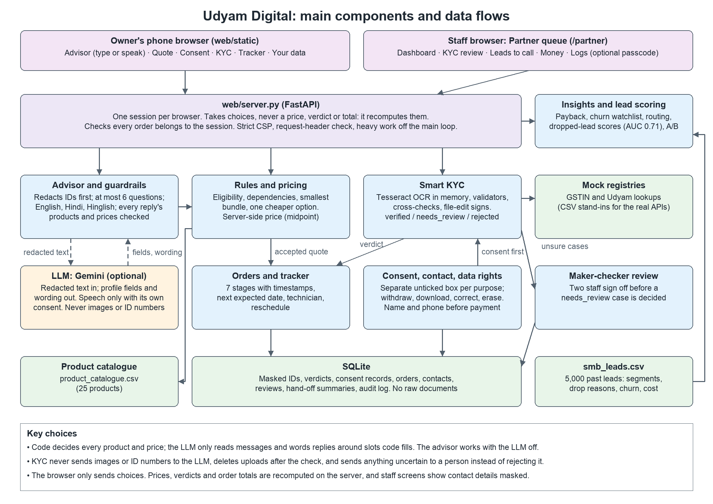
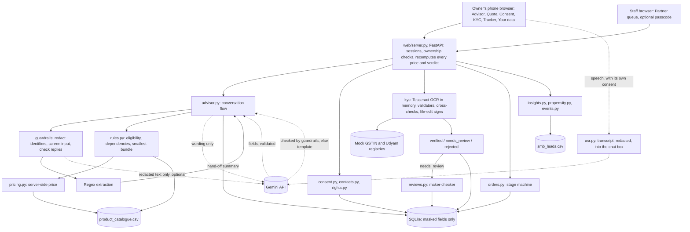

# Architecture

Mermaid source of the same flow:

```mermaid
flowchart TD
  U[Owner's phone browser: Advisor, Quote, Consent, KYC, Tracker, Your data] --> S[web/server.py, FastAPI: sessions, ownership checks, recomputes every price and verdict]
  P[Staff browser: Partner queue, optional passcode] --> S
  S --> ADV[advisor.py: conversation flow]
  ADV --> RED[guardrails: redact identifiers, screen input, check replies]
  RED --> EXT[Regex extraction]
  RED -. redacted text only, optional .-> LLM[(Gemini API)]
  U -. speech, with its own consent .-> ASR[asr.py: transcript, redacted, into the chat box]
  ASR -.-> LLM
  LLM -. fields, validated .-> ADV
  EXT --> ADV
  ADV --> RULES[rules.py: eligibility, dependencies, smallest bundle]
  RULES --> PRICE[pricing.py: server-side price]
  PRICE --> CAT[(product_catalogue.csv)]
  RULES --> CAT
  ADV -. wording only .-> LLM
  LLM -. checked by guardrails, else template .-> ADV
  S --> CONS[consent.py, contacts.py, rights.py]
  S --> KYC[kyc: Tesseract OCR in memory, validators, cross-checks, file-edit signs]
  KYC --> REG[(Mock GSTIN and Udyam registries)]
  KYC --> V[verified / needs_review / rejected]
  V -->|needs_review| REV[reviews.py: maker-checker]
  S --> ORD[orders.py: stage machine]
  S --> INS[insights.py, propensity.py, events.py]
  INS --> LEADS[(smb_leads.csv)]
  CONS --> DB[(SQLite: masked fields only)]
  V --> DB
  REV --> DB
  ORD --> DB
  ADV -->|hand-off summary| DB
```

**Key choice:** the LLM can fill profile gaps and reword replies. It cannot choose a product or a price, and the advisor works fully without it.
